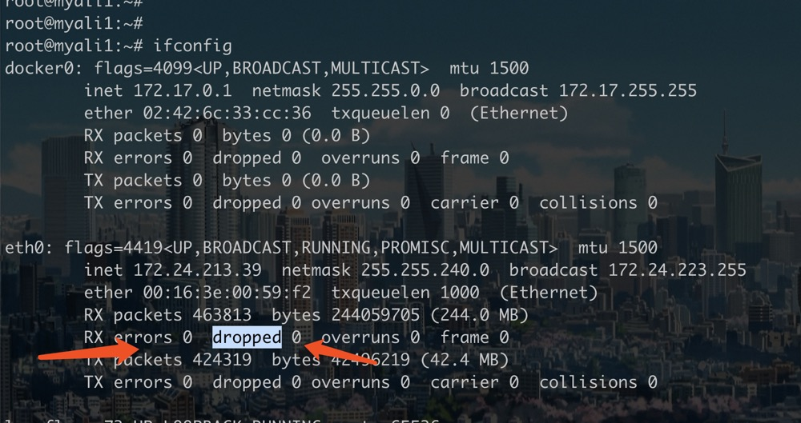
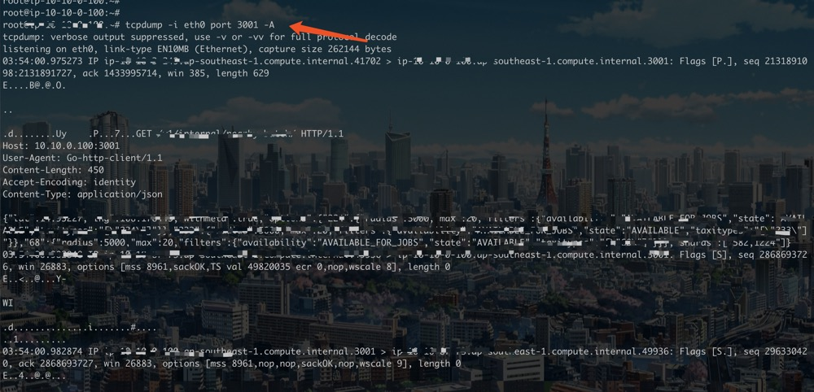

### ethtool - find the information of nic
```shell
[root@hadoop009 var]# ethtool  em1
Settings for em1:
        Supported ports: [ TP ]
        Supported link modes:   10baseT/Half 10baseT/Full 
                                100baseT/Half 100baseT/Full 
                                1000baseT/Full 
        Supported pause frame use: No
        Supports auto-negotiation: Yes
        Advertised link modes:  10baseT/Half 10baseT/Full 
                                100baseT/Half 100baseT/Full 
                                1000baseT/Full 
        Advertised pause frame use: No
        Advertised auto-negotiation: Yes
        Speed: 1000Mb/s
        Duplex: Full
        Port: Twisted Pair
        PHYAD: 1
        Transceiver: internal
        Auto-negotiation: on
        MDI-X: Unknown
        Supports Wake-on: g
        Wake-on: d
        Link detected: yes
```

### ifconfig - packet loss
if `dropped` increased, we should check the netdev length


### tcpdump - dump http content


### To be continued...