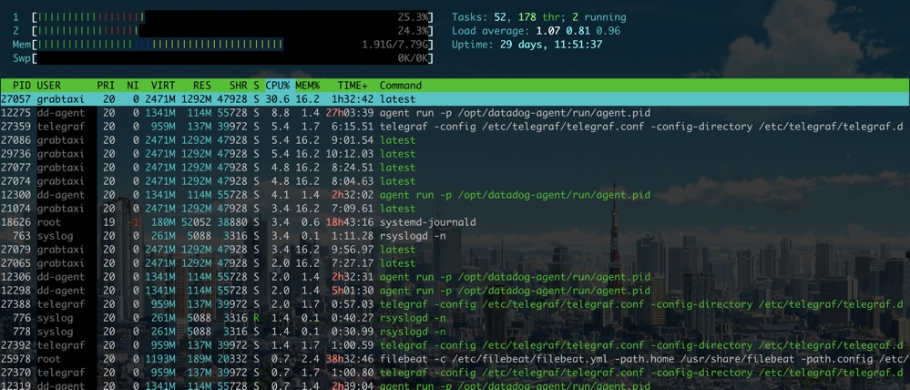
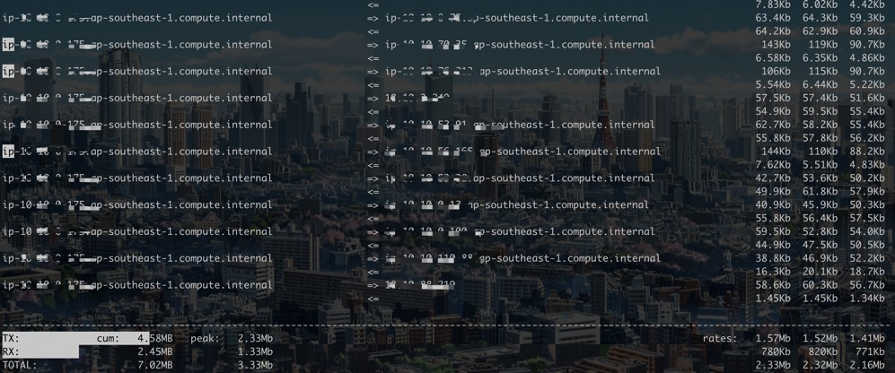

## overall
Know the current system status at a glance

#### w - Show who is logged on and what they are doing
```shell
zerun.dong@ip-xx-xx-xx-xx:~$ w
 09:34:51 up 29 days, 11:39,  2 users,  load average: 1.29, 1.29, 1.22
USER     TTY      FROM             LOGIN@   IDLE   JCPU   PCPU WHAT
zerun.do pts/0    xx-xx-xx-xx     03:38    1:24   0.06s  0.00s sshd: zerun.dong [priv]
zerun.do pts/1    xx-xx-xx-xx     09:30    1.00s  0.02s  0.00s w
```

#### free - Display amount of free and used memory in the system
```shell
zerun.dong@ip-xx-xx-xx-xx:~$ free -h
              total        used        free      shared  buff/cache   available
Mem:           7.8G        1.8G        3.3G        820K        2.7G        6.3G
Swap:            0B          0B          0B
```

#### vmstat - Report virtual memory statistics
pay attention to the `st` field
```shell
zerun.dong@ip-xx-xx-xx-xx:~$ vmstat 1
procs -----------memory---------- ---swap-- -----io---- -system-- ------cpu-----
 r  b   swpd   free   buff  cache   si   so    bi    bo   in   cs us sy id wa st
 1  0      0 2604780 320836 3256256    0    0     0   247    0    1 15  5 80  0  0
 0  0      0 2604196 320836 3256464    0    0     0     0 10899 16719 16  7 76  0  1
 0  0      0 2604516 320836 3256540    0    0     0    88 10675 16855 27  7 66  0  0
 0  0      0 2604360 320836 3256632    0    0     0     0 9806 15505 13  6 81  0  0
 0  0      0 2604268 320836 3256752    0    0     0     0 10487 16803 14  5 81  0  1
 0  0      0 2604036 320836 3256856    0    0     0  7876 10433 16069 25 10 63  2  0
```

#### top&htop - display Linux processes
```shell
zerun.dong@ip-xx-xx-xx-xx:~$ top
top - 09:45:29 up 29 days, 11:50,  2 users,  load average: 0.56, 0.75, 0.97
Tasks: 121 total,   1 running,  79 sleeping,   0 stopped,   0 zombie
%Cpu(s): 20.5 us,  7.3 sy,  0.0 ni, 70.6 id,  0.2 wa,  0.0 hi,  1.2 si,  0.3 st
KiB Mem :  8166936 total,  3133876 free,  2005792 used,  3027268 buff/cache
KiB Swap:        0 total,        0 free,        0 used.  6767832 avail Mem

  PID USER      PR  NI    VIRT    RES    SHR S  %CPU %MEM     TIME+ COMMAND
27057 grabtaxi  20   0 2530724 1.262g  47928 S  27.7 16.2  92:18.27 latest
25978 root      20   0 1222376 194084  20332 S  11.0  2.4   2312:38 filebeat
12275 dd-agent  20   0 1374036 117140  55728 S   8.0  1.4   1623:33 agent
18626 root      19  -1  172852  42344  29172 S   5.3  0.5   1123:13 systemd-journal
27359 telegraf  20   0  982912 140704  39972 S   4.3  1.7   6:12.10 telegraf
  763 syslog    20   0  267340   5088   3316 S   3.0  0.1   1:09.16 rsyslogd
12276 dd-agent  20   0  884240  42736  25988 S   1.0  0.5  66:30.50 process-agent
    7 root      20   0       0      0      0 S   0.3  0.0   7:38.23 ksoftirqd/0
13141 root      20   0  277132  35808   7780 S   0.3  0.4   1:38.08 nessusd
    1 root      20   0  160016   9708   7072 S   0.0  0.1   2:13.71 systemd
```


#### iostat - Report Central Processing Unit (CPU) statistics and input/output statistics for devices and partitions
```shell
zerun.dong@ip-xx-xx-xx-xx:~$ iostat -x 1
Linux 4.15.0-1039-aws (ip-10-10-0-175) 	11/28/19 	_x86_64_	(2 CPU)

avg-cpu:  %user   %nice %system %iowait  %steal   %idle
          16.50    0.03    5.51    0.14    0.68   77.15

Device            r/s     w/s     rkB/s     wkB/s   rrqm/s   wrqm/s  %rrqm  %wrqm r_await w_await aqu-sz rareq-sz wareq-sz  svctm  %util
loop0            0.00    0.00      0.01      0.00     0.00     0.00   0.00   0.00    4.37    0.00   0.00     1.11     0.00   0.09   0.00
loop1            0.00    0.00      0.00      0.00     0.00     0.00   0.00   0.00    1.02    0.00   0.00     1.09     0.00   0.04   0.00
loop2            0.01    0.00      0.01      0.00     0.00     0.00   0.00   0.00    0.05    0.00   0.00     1.08     0.00   0.00   0.00
loop3            0.00    0.00      0.00      0.00     0.00     0.00   0.00   0.00    0.08    0.00   0.00     1.08     0.00   0.00   0.00
loop4            0.01    0.00      0.01      0.00     0.00     0.00   0.00   0.00    0.07    0.00   0.00     1.09     0.00   0.00   0.00
loop5            0.00    0.00      0.00      0.00     0.00     0.00   0.00   0.00    0.00    0.00   0.00     1.60     0.00   0.00   0.00
xvda             0.08   25.26      1.33    458.48     0.00     8.47   2.36  25.11    0.92   12.03   0.30    17.71    18.15   0.22   0.57
```
#### iotop - simple top-like I/O monitor
```shell
zerun.dong@ip-xx-xx-xx-xx:~$ iotop
Total DISK READ :       0.00 B/s | Total DISK WRITE :     918.41 K/s
Actual DISK READ:       0.00 B/s | Actual DISK WRITE:      94.20 K/s
  TID  PRIO  USER     DISK READ  DISK WRITE  SWAPIN     IO>    COMMAND
  507 be/3 root        0.00 B/s    0.00 B/s  0.00 %  0.23 % [jbd2/xvda1-8]
27654 be/4 root        0.00 B/s    3.92 K/s  0.00 %  0.05 % filebeat -c /etc/filebeat/filebeat.yml -path.~var/lib/filebeat -path.logs /var/log/filebeat
27633 be/4 root        0.00 B/s    0.00 B/s  0.00 %  0.01 % filebeat -c /etc/filebeat/filebeat.yml -path.~var/lib/filebeat -path.logs /var/log/filebeat
18331 be/3 root        0.00 B/s  706.47 K/s  0.00 %  0.00 % systemd-journald
24081 be/4 syslog      0.00 B/s  208.01 K/s  0.00 %  0.00 % rsyslogd -n [rs:main Q:Reg]
    1 be/4 root        0.00 B/s    0.00 B/s  0.00 %  0.00 % systemd --system --deserialize 40
    2 be/4 root        0.00 B/s    0.00 B/s  0.00 %  0.00 % [kthreadd]
```

#### iftop - display bandwidth usage on an interface by host


#### df - report file system disk space usage
list disk spaces information
```shell
zerun.dong@ip-xx-xx-xx-xx:~$ df -h
Filesystem      Size  Used Avail Use% Mounted on
udev            3.9G     0  3.9G   0% /dev
tmpfs           798M  820K  797M   1% /run
/dev/xvda1       12G  5.0G  6.7G  43% /
tmpfs           3.9G     0  3.9G   0% /dev/shm
tmpfs           5.0M     0  5.0M   0% /run/lock
tmpfs           3.9G     0  3.9G   0% /sys/fs/cgroup
/dev/loop1       18M   18M     0 100% /snap/amazon-ssm-agent/1335
/dev/loop2       90M   90M     0 100% /snap/core/7917
/dev/loop3       18M   18M     0 100% /snap/amazon-ssm-agent/1480
/dev/loop4       90M   90M     0 100% /snap/core/8039
tmpfs           798M     0  798M   0% /run/user/1015
```
list inode information
```shell
zerun.dong@ip-xx-xx-xx-xx:~$ df -hi
Filesystem     Inodes IUsed IFree IUse% Mounted on
udev             994K   296  994K    1% /dev
tmpfs            997K   492  997K    1% /run
/dev/xvda1       1.5M  207K  1.3M   14% /
tmpfs            997K     1  997K    1% /dev/shm
tmpfs            997K     4  997K    1% /run/lock
tmpfs            997K    18  997K    1% /sys/fs/cgroup
/dev/loop1         15    15     0  100% /snap/amazon-ssm-agent/1335
/dev/loop2        13K   13K     0  100% /snap/core/7917
/dev/loop3         15    15     0  100% /snap/amazon-ssm-agent/1480
/dev/loop4        13K   13K     0  100% /snap/core/8039
tmpfs            997K    10  997K    1% /run/user/1015
```