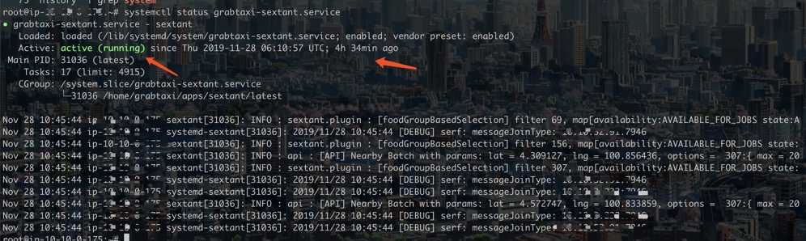

### startup
> systemctl status grabtaxi-xxxxxx.service

### open files
### network sockets
### disk write/read
### cpu usage
### memory pagefault
```shell
root@ip-10-10-0-175:~# mpstat -P ALL 1
Linux 4.15.0-1039-aws (ip-10-10-0-175) 	11/28/19 	_x86_64_	(2 CPU)

06:13:04     CPU    %usr   %nice    %sys %iowait    %irq   %soft  %steal  %guest  %gnice   %idle
06:13:05     all    8.42    0.00    2.63    0.00    0.00    0.53    0.00    0.00    0.00   88.42
06:13:05       0    9.47    0.00    2.11    0.00    0.00    1.05    0.00    0.00    0.00   87.37
06:13:05       1    7.37    0.00    3.16    0.00    0.00    0.00    0.00    0.00    0.00   89.47

06:13:05     CPU    %usr   %nice    %sys %iowait    %irq   %soft  %steal  %guest  %gnice   %idle
06:13:06     all    6.22    0.00    3.11    0.00    0.00    0.52    0.52    0.00    0.00   89.64
06:13:06       0    7.22    0.00    3.09    0.00    0.00    0.00    1.03    0.00    0.00   88.66
06:13:06       1    5.21    0.00    3.12    0.00    0.00    0.00    1.04    0.00    0.00   90.62
```
```shell
root@ip-10-10-0-175:~# pidstat -w -p 31036 1
Linux 4.15.0-1039-aws (ip-10-10-0-175) 	11/28/19 	_x86_64_	(2 CPU)

06:14:47      UID       PID   cswch/s nvcswch/s  Command
06:14:48     1010     31036    554.00    348.00  latest
06:14:49     1010     31036    416.00    333.00  latest
06:14:50     1010     31036    446.00    378.00  latest
06:14:51     1010     31036    457.00    346.00  latest
06:14:52     1010     31036    265.00    225.00  latest
```
```shell
root@ip-10-10-0-175:~# pidstat -t -p 31036 1
Linux 4.15.0-1039-aws (ip-10-10-0-175) 	11/28/19 	_x86_64_	(2 CPU)

06:17:30      UID      TGID       TID    %usr %system  %guest   %wait    %CPU   CPU  Command
06:17:31     1010     31036         -   23.00    8.00    0.00    0.00   31.00     1  latest
06:17:31     1010         -     31036    0.00    0.00    0.00    0.00    0.00     1  |__latest
06:17:31     1010         -     31043    1.00    2.00    0.00    7.00    3.00     1  |__latest
06:17:31     1010         -     31044    0.00    0.00    0.00    0.00    0.00     0  |__latest
06:17:31     1010         -     31045    0.00    0.00    0.00    0.00    0.00     0  |__latest
06:17:31     1010         -     31046    0.00    0.00    0.00    0.00    0.00     0  |__latest
06:17:31     1010         -     31048    0.00    0.00    0.00    0.00    0.00     1  |__latest
06:17:31     1010         -     31053    0.00    0.00    0.00    0.00    0.00     1  |__latest
06:17:31     1010         -     31054    0.00    0.00    0.00    0.00    0.00     0  |__latest
06:17:31     1010         -     31056    3.00    3.00    0.00    5.00    6.00     0  |__latest
06:17:31     1010         -     31057    0.00    0.00    0.00    0.00    0.00     0  |__latest
06:17:31     1010         -     31059    4.00    0.00    0.00    6.00    4.00     1  |__latest
06:17:31     1010         -     31061    5.00    1.00    0.00    5.00    6.00     1  |__latest
06:17:31     1010         -     31062    0.00    0.00    0.00    0.00    0.00     1  |__latest
06:17:31     1010         -     31063    4.00    1.00    0.00    6.00    5.00     1  |__latest
06:17:31     1010         -     31064    4.00    2.00    0.00    6.00    6.00     0  |__latest
06:17:31     1010         -     31065    1.00    0.00    0.00    1.00    1.00     0  |__latest
```