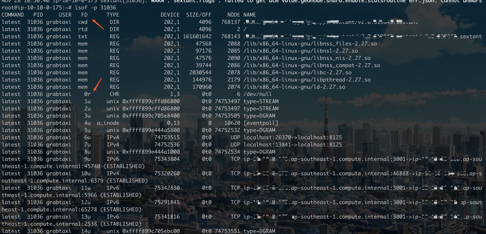
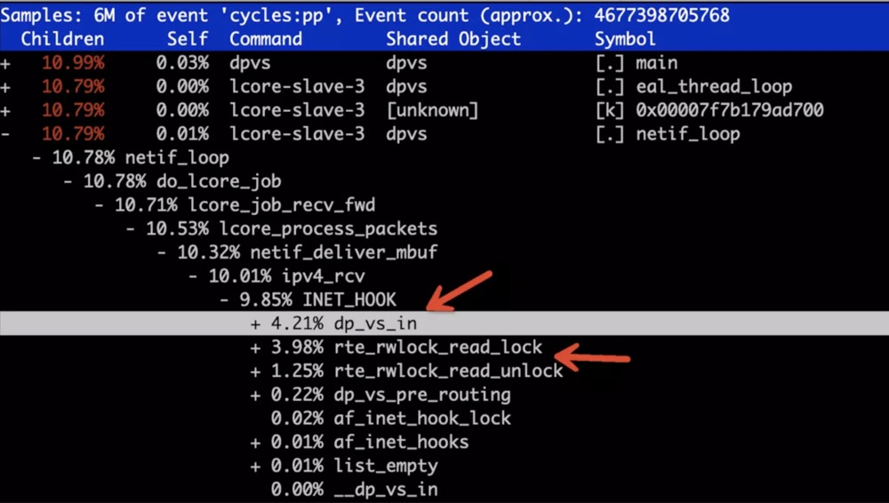

### startup
`systemctl status grabtaxi-xxxxxx.service` we can see status, systemctl config and pid

### open files
through `lsof -p pid`, we can see the stdin (fd 0) redirect to `/dev/null`, stdout and stderr to `STREAM` which taken over by `syslog`

### network sockets
* list listened process
```shell
zerun.dong@ip-xx-xx-xx-xx:~$ ss -antlp
State       Recv-Q       Send-Q              Local Address:Port                Peer Address:Port
LISTEN      0            10240                 10.10.0.175:7946                     0.0.0.0:*           users:(("latest",pid=31036,fd=47))
LISTEN      0            10240                   127.0.0.1:5066                     0.0.0.0:*           users:(("filebeat",pid=27631,fd=5))
LISTEN      0            10240                 10.10.0.175:7373                     0.0.0.0:*           users:(("latest",pid=31036,fd=46))
LISTEN      0            10240                   127.0.0.1:6062                     0.0.0.0:*           users:(("process-agent",pid=21061,fd=7))
LISTEN      0            128                       0.0.0.0:22                       0.0.0.0:*           users:(("sshd",pid=26599,fd=3))
LISTEN      0            100                       0.0.0.0:25                       0.0.0.0:*           users:(("master",pid=7827,fd=13))
LISTEN      0            10240                   127.0.0.1:5000                     0.0.0.0:*           users:(("agent",pid=21058,fd=6))
LISTEN      0            10240                   127.0.0.1:8200                     0.0.0.0:*           users:(("vault",pid=14413,fd=6))
LISTEN      0            10240                   127.0.0.1:5001                     0.0.0.0:*           users:(("agent",pid=21058,fd=3))
LISTEN      0            128                          [::]:22                          [::]:*           users:(("sshd",pid=26599,fd=4))
LISTEN      0            10240                           *:8087                           *:*           users:(("latest",pid=31036,fd=132))
LISTEN      0            10240                           *:8088                           *:*           users:(("latest",pid=31036,fd=139))
LISTEN      0            10240                           *:8089                           *:*           users:(("latest",pid=31036,fd=154))
LISTEN      0            10240                           *:3001                           *:*           users:(("latest",pid=31036,fd=64))
LISTEN      0            100                          [::]:25                          [::]:*           users:(("master",pid=7827,fd=14))
LISTEN      0            10240                           *:3002                           *:*           users:(("latest",pid=31036,fd=65))
LISTEN      0            10240                           *:25000                          *:*           users:(("latest",pid=31036,fd=18))
```

* list tcp timer
```shell
root@ip-10-10-0-175:~# ss -anto
TIME-WAIT     0           0                          10.10.0.175:7946                        10.10.0.13:34136       timer:(timewait,4.748ms,0)
ESTAB         0           0                          10.10.0.175:42440                     10.10.56.165:9094
ESTAB         0           0                          10.10.0.175:51444                     10.196.41.33:9094        timer:(keepalive,8.956ms,0)
TIME-WAIT     0           0                            127.0.0.1:17656                        127.0.0.1:5066        timer:(timewait,8.972ms,0)
TIME-WAIT     0           0                          10.10.0.175:7946                       10.10.3.232:28114       timer:(timewait,36sec,0)
TIME-WAIT     0           0                          10.10.0.175:7946                       10.10.53.38:54844       timer:(timewait,44sec,0)
TIME-WAIT     0           0                          10.10.0.175:7946                        10.10.0.75:18628       timer:(timewait,9.568ms,0)
TIME-WAIT     0           0                          10.10.0.175:47160                      10.10.0.228:7946        timer:(timewait,18sec,0)
TIME-WAIT     0           0                          10.10.0.175:7946                       10.10.0.100:15568       timer:(timewait,49sec,0)
ESTAB         0           0                          10.10.0.175:13182                     10.10.87.153:2379        timer:(keepalive,14sec,0)
TIME-WAIT     0           0                          10.10.0.175:7946                       10.10.3.232:28148       timer:(timewait,46sec,0)
TIME-WAIT     0           0                          10.10.0.175:7946                       10.10.0.100:15418       timer:(timewait,11sec,0)
TIME-WAIT     0           0                          10.10.0.175:20220                     52.219.124.7:443         timer:(timewait,,0)
ESTAB         0           0                          10.10.0.175:12378                    10.196.39.136:9094        timer:(keepalive,5.632ms,0)
```

### memory pagefault
```shell
zerun.dong@ip-xx-xx-xx-xx:~$ pidstat -r -p 31036 1
Linux 4.15.0-1039-aws (ip-10-10-0-175) 	11/28/19 	_x86_64_	(2 CPU)
11:16:14      UID       PID  minflt/s  majflt/s     VSZ     RSS   %MEM  Command
11:16:15     1010     31036      0.00      0.00 2547792 1355116  16.59  latest
11:16:16     1010     31036      0.00      0.00 2547792 1355116  16.59  latest
11:16:17     1010     31036      0.00      0.00 2547792 1355116  16.59  latest
11:16:18     1010     31036      0.00      0.00 2547792 1355116  16.59  latest
11:16:19     1010     31036      0.00      0.00 2547792 1355116  16.59  latest
11:16:20     1010     31036      0.00      0.00 2547792 1355116  16.59  latest
11:16:21     1010     31036      0.00      0.00 2547792 1355116  16.59  latest
11:16:22     1010     31036      0.00      0.00 2547792 1355116  16.59  latest
```

### context switch
* `cswch` number of voluntary context switches the task made per second. A voluntary context switch occurs when a task blocks because it requires a resource that is unavailable.
* `nvcswch` number of non voluntary context switches the task made per second. A involuntary context switch takes place when a task executes for the duration of its time slice and then is forced to relinquish the processor.
```shell
zerun.dong@ip-xx-xx-xx-xx:~$ pidstat -w -p 31036 1
Linux 4.15.0-1039-aws (ip-10-10-0-175) 	11/28/19 	_x86_64_	(2 CPU)

06:14:47      UID       PID   cswch/s nvcswch/s  Command
06:14:48     1010     31036    554.00    348.00  latest
06:14:49     1010     31036    416.00    333.00  latest
06:14:50     1010     31036    446.00    378.00  latest
06:14:51     1010     31036    457.00    346.00  latest
06:14:52     1010     31036    265.00    225.00  latest
```
### cpu usage
* pay attention to `soft` field, this value very high means a bottleneck of softirq
```shell
zerun.dong@ip-xx-xx-xx-xx:~$ mpstat -P ALL 1
Linux 4.15.0-1039-aws (ip-10-10-0-175) 	11/28/19 	_x86_64_	(2 CPU)

06:13:04     CPU    %usr   %nice    %sys %iowait    %irq   %soft  %steal  %guest  %gnice   %idle
06:13:05     all    8.42    0.00    2.63    0.00    0.00    0.53    0.00    0.00    0.00   88.42
06:13:05       0    9.47    0.00    2.11    0.00    0.00    1.05    0.00    0.00    0.00   87.37
06:13:05       1    7.37    0.00    3.16    0.00    0.00    0.00    0.00    0.00    0.00   89.47

06:13:05     CPU    %usr   %nice    %sys %iowait    %irq   %soft  %steal  %guest  %gnice   %idle
06:13:06     all    6.22    0.00    3.11    0.00    0.00    0.52    0.52    0.00    0.00   89.64
06:13:06       0    7.22    0.00    3.09    0.00    0.00    0.00    1.03    0.00    0.00   88.66
06:13:06       1    5.21    0.00    3.12    0.00    0.00    0.00    1.04    0.00    0.00   90.62
```
```shell
zerun.dong@ip-xx-xx-xx-xx:~$ pidstat -t -p 31036 1
Linux 4.15.0-1039-aws (ip-10-10-0-175) 	11/28/19 	_x86_64_	(2 CPU)

06:17:30      UID      TGID       TID    %usr %system  %guest   %wait    %CPU   CPU  Command
06:17:31     1010     31036         -   23.00    8.00    0.00    0.00   31.00     1  latest
06:17:31     1010         -     31036    0.00    0.00    0.00    0.00    0.00     1  |__latest
06:17:31     1010         -     31043    1.00    2.00    0.00    7.00    3.00     1  |__latest
06:17:31     1010         -     31044    0.00    0.00    0.00    0.00    0.00     0  |__latest
06:17:31     1010         -     31045    0.00    0.00    0.00    0.00    0.00     0  |__latest
06:17:31     1010         -     31046    0.00    0.00    0.00    0.00    0.00     0  |__latest
06:17:31     1010         -     31048    0.00    0.00    0.00    0.00    0.00     1  |__latest
06:17:31     1010         -     31053    0.00    0.00    0.00    0.00    0.00     1  |__latest
06:17:31     1010         -     31054    0.00    0.00    0.00    0.00    0.00     0  |__latest
06:17:31     1010         -     31056    3.00    3.00    0.00    5.00    6.00     0  |__latest
06:17:31     1010         -     31057    0.00    0.00    0.00    0.00    0.00     0  |__latest
06:17:31     1010         -     31059    4.00    0.00    0.00    6.00    4.00     1  |__latest
06:17:31     1010         -     31061    5.00    1.00    0.00    5.00    6.00     1  |__latest
06:17:31     1010         -     31062    0.00    0.00    0.00    0.00    0.00     1  |__latest
06:17:31     1010         -     31063    4.00    1.00    0.00    6.00    5.00     1  |__latest
06:17:31     1010         -     31064    4.00    2.00    0.00    6.00    6.00     0  |__latest
06:17:31     1010         -     31065    1.00    0.00    0.00    1.00    1.00     0  |__latest
```

### strace - trace system calls and signals
```shell
zerun.dong@ip-xx-xx-xx-xx:~$ strace hostname
execve("/bin/hostname", ["hostname"], 0x7ffe7b9a5300 /* 16 vars */) = 0
brk(NULL)                               = 0x55ac12529000
access("/etc/ld.so.nohwcap", F_OK)      = -1 ENOENT (No such file or directory)
access("/etc/ld.so.preload", R_OK)      = -1 ENOENT (No such file or directory)
openat(AT_FDCWD, "/etc/ld.so.cache", O_RDONLY|O_CLOEXEC) = 3
fstat(3, {st_mode=S_IFREG|0644, st_size=39170, ...}) = 0
mmap(NULL, 39170, PROT_READ, MAP_PRIVATE, 3, 0) = 0x7f238e1de000
close(3)                                = 0
access("/etc/ld.so.nohwcap", F_OK)      = -1 ENOENT (No such file or directory)
openat(AT_FDCWD, "/lib/x86_64-linux-gnu/libc.so.6", O_RDONLY|O_CLOEXEC) = 3
read(3, "\177ELF\2\1\1\3\0\0\0\0\0\0\0\0\3\0>\0\1\0\0\0\260\34\2\0\0\0\0\0"..., 832) = 832
fstat(3, {st_mode=S_IFREG|0755, st_size=2030544, ...}) = 0
mmap(NULL, 8192, PROT_READ|PROT_WRITE, MAP_PRIVATE|MAP_ANONYMOUS, -1, 0) = 0x7f238e1dc000
mmap(NULL, 4131552, PROT_READ|PROT_EXEC, MAP_PRIVATE|MAP_DENYWRITE, 3, 0) = 0x7f238dbd0000
mprotect(0x7f238ddb7000, 2097152, PROT_NONE) = 0
mmap(0x7f238dfb7000, 24576, PROT_READ|PROT_WRITE, MAP_PRIVATE|MAP_FIXED|MAP_DENYWRITE, 3, 0x1e7000) = 0x7f238dfb7000
mmap(0x7f238dfbd000, 15072, PROT_READ|PROT_WRITE, MAP_PRIVATE|MAP_FIXED|MAP_ANONYMOUS, -1, 0) = 0x7f238dfbd000
close(3)                                = 0
arch_prctl(ARCH_SET_FS, 0x7f238e1dd500) = 0
mprotect(0x7f238dfb7000, 16384, PROT_READ) = 0
mprotect(0x55ac117f1000, 4096, PROT_READ) = 0
mprotect(0x7f238e1e8000, 4096, PROT_READ) = 0
munmap(0x7f238e1de000, 39170)           = 0
brk(NULL)                               = 0x55ac12529000
brk(0x55ac1254a000)                     = 0x55ac1254a000
uname({sysname="Linux", nodename="ip-xxxxx-x-x-xx", ...}) = 0
fstat(1, {st_mode=S_IFCHR|0600, st_rdev=makedev(136, 0), ...}) = 0
write(1, "ip-10-10-0-100\n", 15ip-10-10-0-100
)        = 15
exit_group(0)                           = ?
+++ exited with 0 +++
```

### perf - Performance analysis tools for Linux
```shell
root# perf record -g -p `pidof dpvs` #after 30 seconds, ctrl+c
root# perf report -i ./perf.data
```

